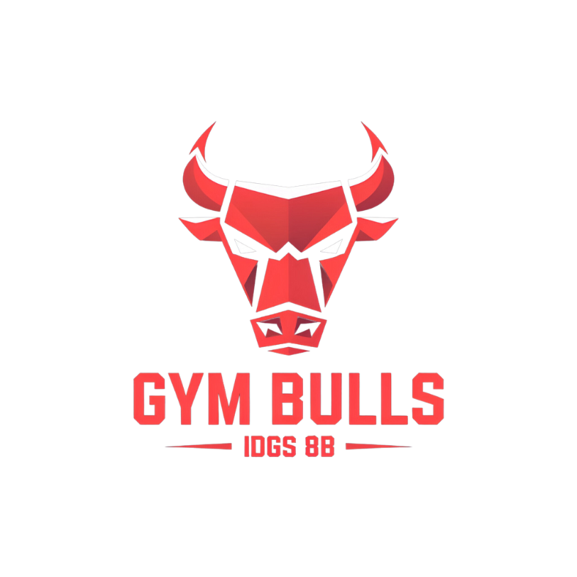
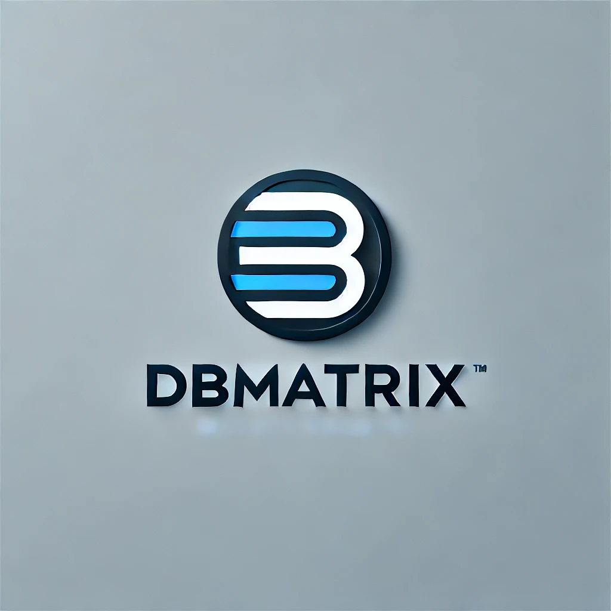
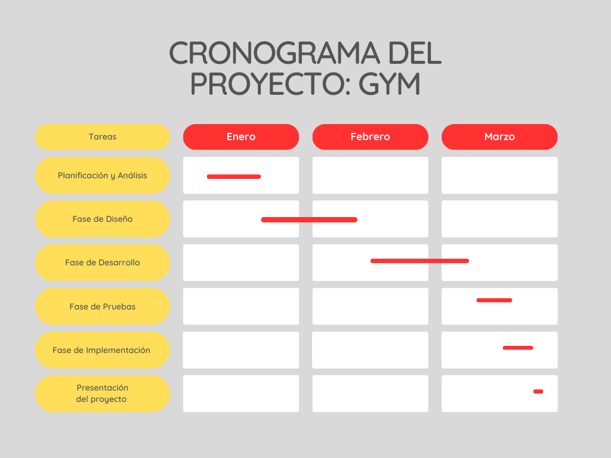
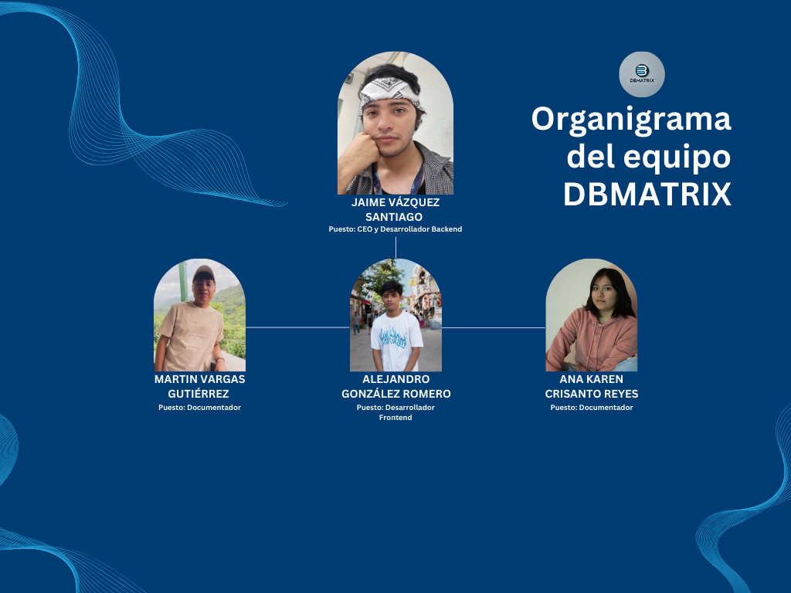

# 🏋️‍♂️ Proyecto-Gym

## 🎨 GYM FIT - IDENTIDAD GRÁFICA
La identidad gráfica de **GymBulls** busca transmitir valores de **salud, bienestar, comunidad e innovación**. Cada elemento visual está diseñado para resonar con la audiencia, destacando la importancia de llevar un estilo de vida saludable, mantenerse en forma y promover la actividad física en la comunidad.

---

## 🏷️ LOGOTIPOS

| Logo de la Aplicación                                    | Logo de la Empresa                                              |
| -------------------------------------------------------- | --------------------------------------------------------------- |
|  |  |

---

## 📝 DESCRIPCIÓN
La propuesta es desarrollar una **aplicación web** que facilite a los usuarios el acceso a **rutinas personalizadas** de entrenamiento, seguimiento de progreso, recomendaciones nutricionales y la posibilidad de reservar clases o sesiones en el gimnasio. Esta plataforma también permitirá a los usuarios realizar un seguimiento de su **salud y bienestar general**.

---

## ❌ PLANTEAMIENTO DEL PROBLEMA
Muchos individuos enfrentan dificultades para mantenerse motivados, seguir una rutina adecuada y llevar un estilo de vida saludable de manera constante. Además, muchos gimnasios **no cuentan con plataformas accesibles** para hacer seguimiento de los progresos de los miembros.
Con una aplicación web, se puede proporcionar un espacio donde los usuarios tengan acceso a **rutinas personalizadas, métricas de rendimiento, motivación y la opción de interactuar con entrenadores y otros miembros**.

---

## ✅ PROPUESTA DE SOLUCIÓN
Crear una **plataforma web integral** que permita a los usuarios acceder a **planes de entrenamiento adaptados a sus necesidades**, realizar un **seguimiento del progreso físico y salud**, y mantenerse motivados a través de recomendaciones, notificaciones y un **sistema de reservas en línea** para clases grupales o personales.

---

## 🎯 OBJETIVO GENERAL
Desarrollar una aplicación web para **GymBulls** que proporcione a los usuarios herramientas para **gestionar sus entrenamientos, seguir su progreso y mejorar su bienestar físico**, brindando además la posibilidad de **reservar clases y recibir asesoramiento personalizado**.

---

## 📌 OBJETIVOS ESPECÍFICOS

- **🏋️‍♂️ Planes de entrenamiento personalizados:** Crear un sistema que genere rutinas adaptadas a las metas, capacidades y preferencias de los usuarios.
- **📊 Seguimiento del progreso físico:** Implementar métricas como peso, repeticiones y calorías quemadas.
- **📅 Implementar un sistema de reservas:** Facilitar la reserva de clases grupales o sesiones con entrenadores personales.
- **🔔 Motivación y notificaciones:** Integrar notificaciones y mensajes motivacionales.
- **🌍 Crear una comunidad activa:** Establecer foros o chats para compartir logros y consejos.

---

## 📅 DIAGRAMA DE GANTT

---

## 👥 TABLA DE COLABORADORES

| Integrante                | Contacto                                                   | Rol                      |
| ------------------------- | ---------------------------------------------------------- | ------------------------ |
| Jaime Vázquez Santiago    | [@jaimevs](https://github.com/jaimevs)                     | CEO y Desarrollo Backend |
| Ana Karen Crisantos Reyes | [@AnaCrisanto](https://github.com/AnaCrisanto)             | Documentador             |
| Martin Vargas Gutierrez   | [@MRVargas19](https://github.com/MRVargas19)               | Documentador             |
| Alejandro Gonzales Romero | [@AlejandroRomero17](https://github.com/AlejandroRomero17) | Desarrollador FrontEnd   |

---

## 📌 ORGANIGRAMA DEL EQUIPO

---

## 🛠️ LISTA DE TECNOLOGÍAS

### 🔹 Cliente:

### 🔹 Servidor:

### 🔹 Pruebas:

### 🔹 Documentación:

